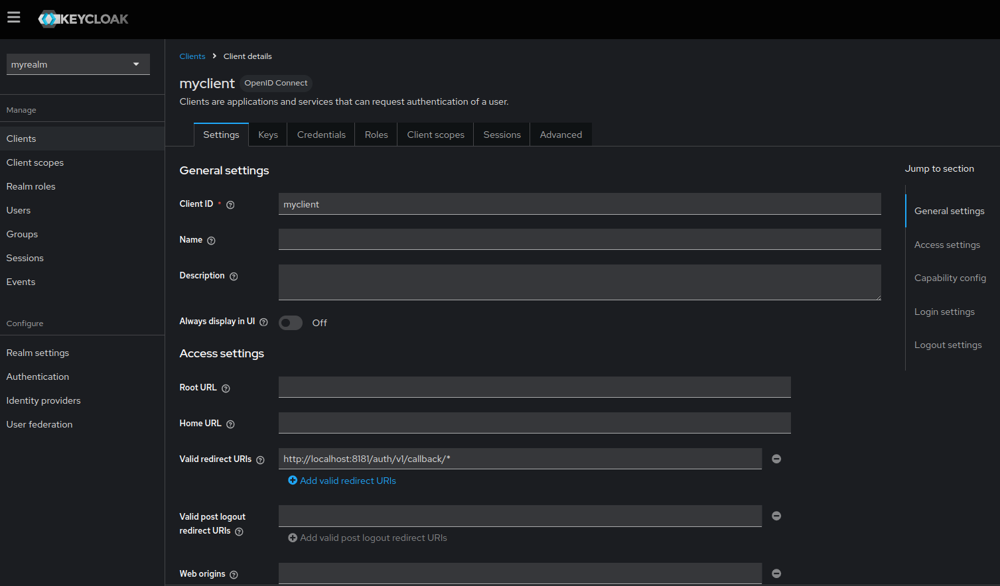
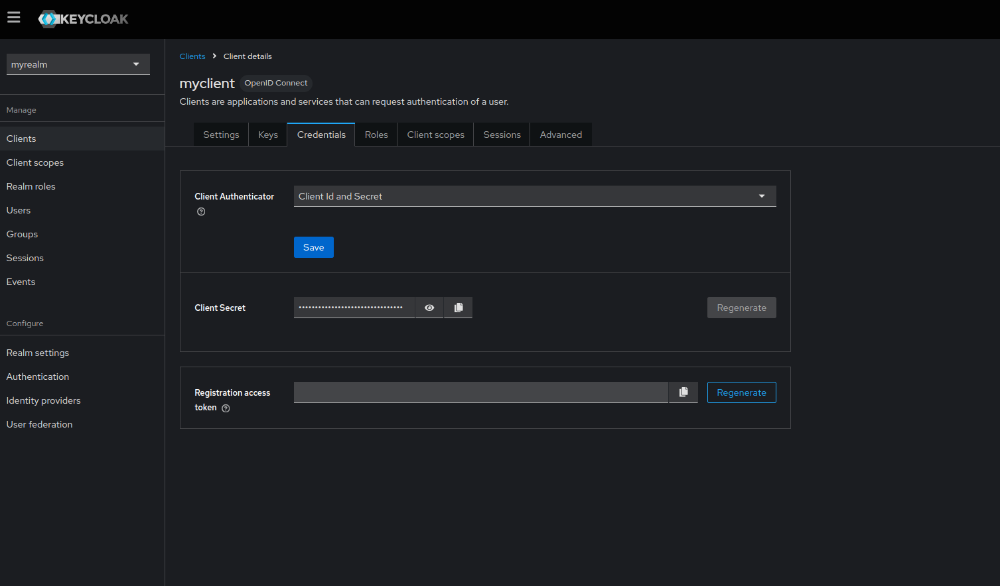
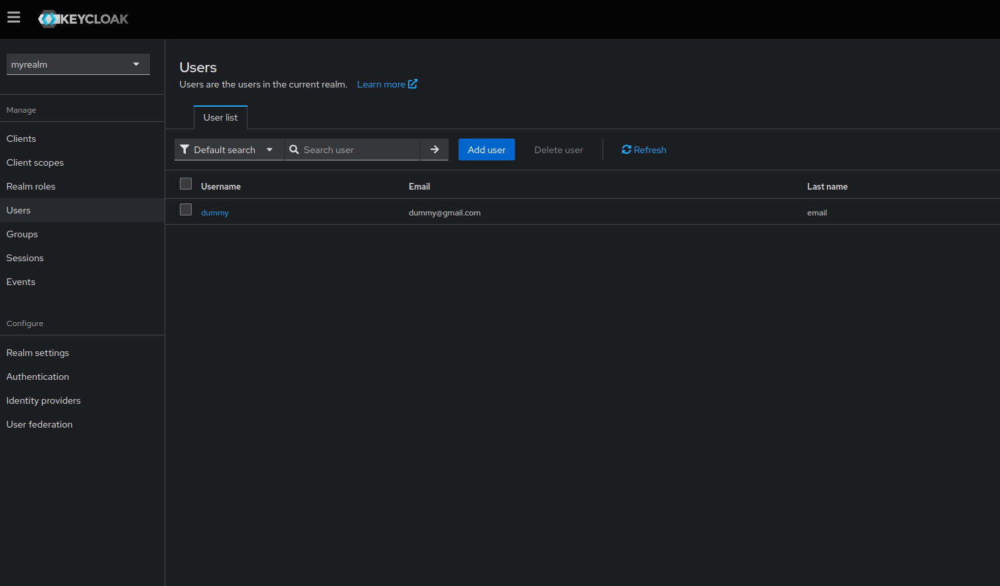
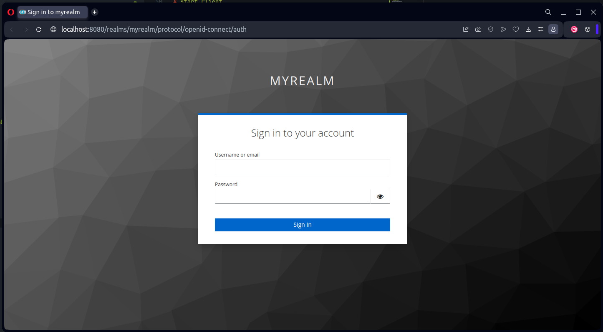

# golang-oauth-keycloak
Golang Oauth using Keycloak

# Setup Keycloak
Start keycloak in docker
```
docker compose up -d
```

Create realms in keycloak and set realms-id in `PROVIDER_URL`
```
PROVIDER_URL=http://localhost:8080/realms/myrealm
```

Create client and set callback url


Generate client secret using `Client Id and Secret`. Add generated-secret to `IDM_SECRET` variable


In users tab, create user you want to authenticate.


Let rest configuration default.

# Setup Env

For the default, we can set env file like this
```
IDM_ID=<client-id>
IDM_SECRET=<generated-secret>
PROVIDER_URL=http://localhost:8080/realms/<realms-name>
MIDDLEWARE_BASE_URL=http://localhost:8181
MIDDLEWARE_AUTH_URL=http://localhost:8181/auth/v1
MIDDLEWARE_TOKEN_URL=http://localhost:8181/auth/v1/token
MIDDLEWARE_CALLBACK_URL=http://localhost:8181/auth/v1/callback
JWT_SIGNATURE_KEY=<randomkey>
JWT_EXPIRED_DURATION=5s
CLIENT_AUTH_TIMEOUT=60s
```

fill client-id, generated-secret, and realms-name based on Keycloak that you setup before.

# Start Middleware
By the default, middleware will run on port 8181
```
go run main.go middleware
```

# Start Client
> Make sure middleware service is running for authenticating the client.

Initializing client
```
go run main.go init
```
Input email that already listed on Keycloak and click auth url.
```
Input email: 
dummy@gmail.com

Waiting for authenticate

http://localhost:8181/auth/v1
```

You will be redirect to login page.


If authenticated, the response in your client should be like this
```
2024/10/02 10:57:27 Client authenticated

{"acr":"1","at_hash":"ndEoNVReVODCZzFBoAf3tw","aud":"myclient","auth_time":1727841615,"azp":"myclient","email":"dummy@gmail.com","email_verified":true,"exp":1727841625,"family_name":"email","given_name":"dummy","iat":1727841615,"iss":"http://localhost:8080/realms/myrealm","jti":"b7dd7a27-4b31-4dfd-8f3b-652fd6856e3e","name":"dummy email","oauth2token":{"access_token":"eyJhbGciOiJSUzI1NiIsInR5cCIgOiAiSldUIiwia2lkIiA6ICJTZ3F2...","token_type":"Bearer","refresh_token":"eyJhbGciOiJIUzUxMiIsInR5cCIgOiAiSldUIiwia2lkIiA6ICJmMWY0...","expiry":"2024-10-02T11:00:25.372075643+07:00"},"preferred_username":"dummy","rawIDtoken":"eyJhbGciOiJSUzI1NiIsInR5cCIgOiAiSldUIiwia2lkIiA6ICJTZ3F2Wl...","sid":"ca3de662-0f23-4346-ba9c-1ba86e7103d3","sub":"3d088ad5-211e-464d-a502-194336802726","typ":"ID"}
```